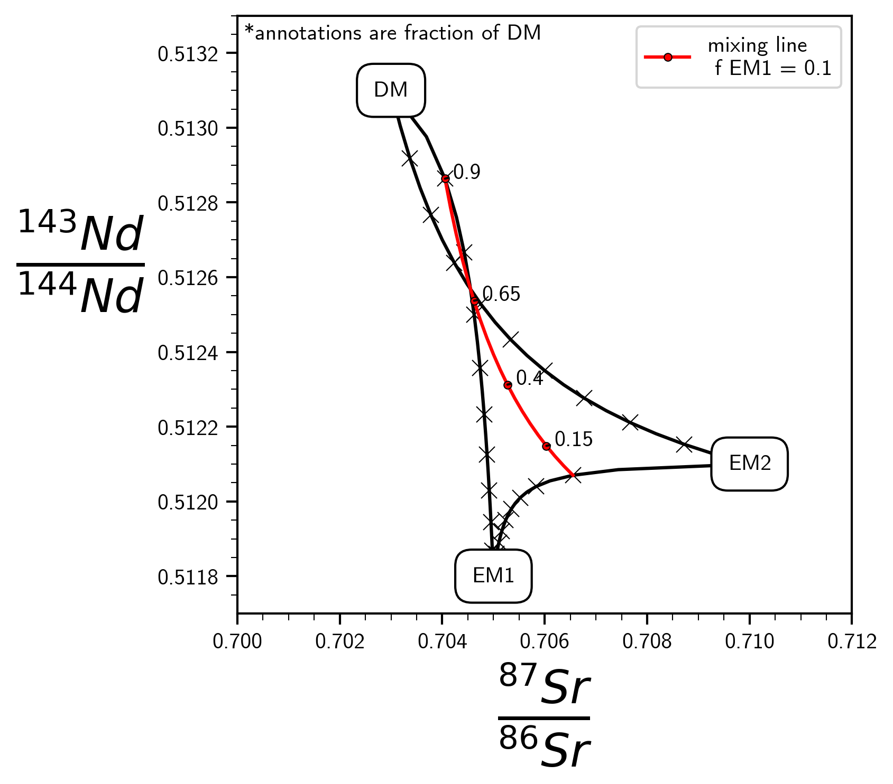

# ```stirstick``` a package for geochemical mixing
Welcome to the repository for the package ```stirstick```! This is a small package solely devoted to calculating and visualizing 2 and 3 component geochemical mixing models. 

Quantifying and visualizing geochemical mixtures exists in many earth science disciplines. This quantification can range from relatively simple two component mixing of concentrations to significantly more complex n-component mixing of isotopic ratios and everything in between. For a more in-depth explanation of mxing theory the following references are incredibly useful:

- [Albarede (1995): _Introduction to Geochemical Modeling_](https://www.cambridge.org/core/books/introduction-to-geochemical-modeling/020E2B1DCF69C3337C0022CAE419A5DC) Chapter 1 on mass balance, mixing, and fractionation.

- [Faure 1998: _Principles and Applications of Geochemistry 2<sup>nd</sup> edition_](https://www.pearson.com/us/higher-education/program/Faure-Principles-and-Applications-of-Geochemistry-2nd-Edition/PGM110956.html) pg. 336 eqns 18.24-18.26
- [Faure and Mensing (2009): _Isotopes Principles and Applications 3<sup>rd</sup> edition_](https://www.wiley.com/en-us/Isotopes%3A+Principles+and+Applications%2C+3rd+Edition-p-9780471384373https://www.wiley.com/en-us/Isotopes%3A+Principles+and+Applications%2C+3rd+Edition-p-9780471384373) chapter 16 on Mixing Theory

## Current capbilities

```stirstick``` is comprised of two modules:

 1. ```mixing```: for create mixing models for the following scenarios
     - Two and three component mixing in concentration-concentration space
     - Two and three component mixing in concentration-ratio space
     - Two and three component mixing in ratio-ratio space

2. ```plotting```: for visualizing all of the aforementioned scenarios.

That's it! 

See the ```walkthrough.ipynb``` for more examples and guides!



## Installation
```
pip install stirstick
```

## Contributing
So far these only cover the very basics of geochemical mixing. If you would like to contribute or have things you want to see implemented please open an issue or create a pull request! 